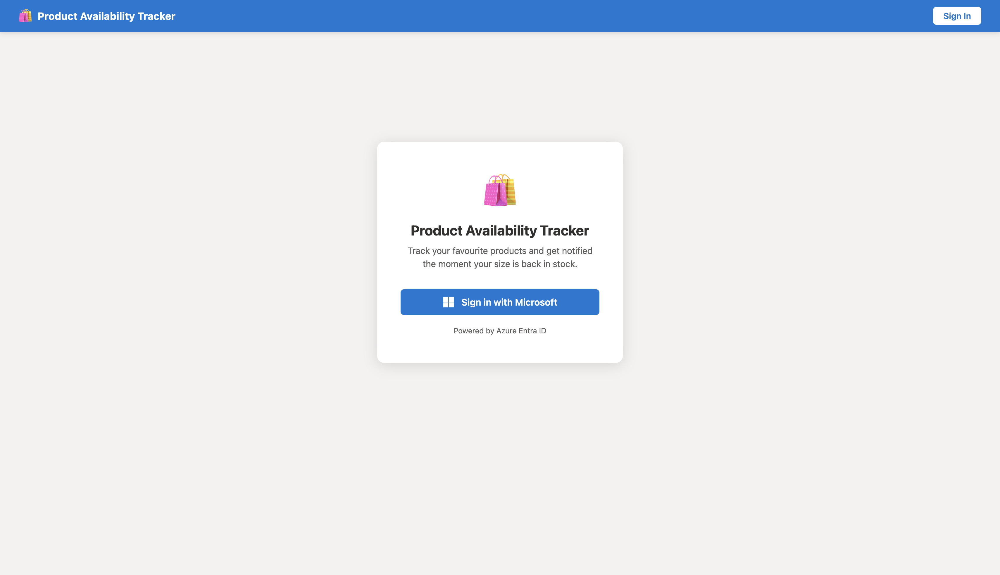
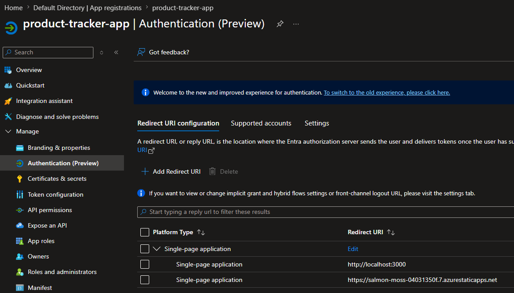
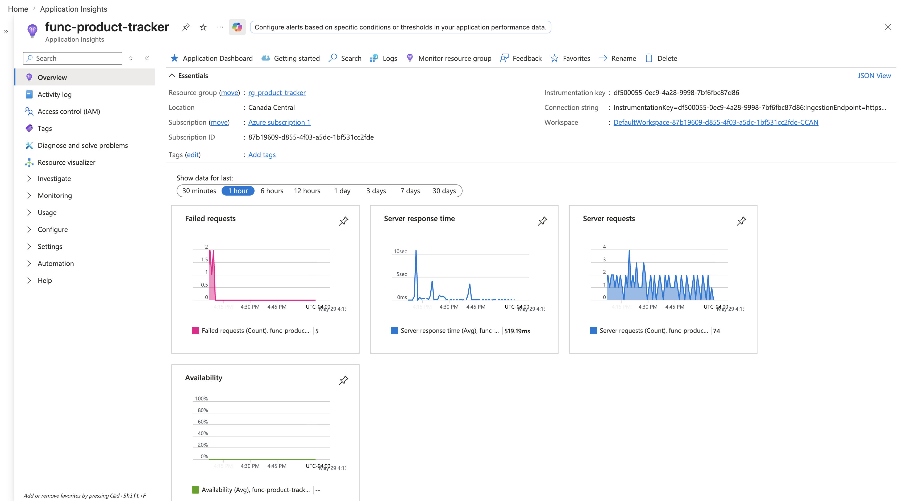
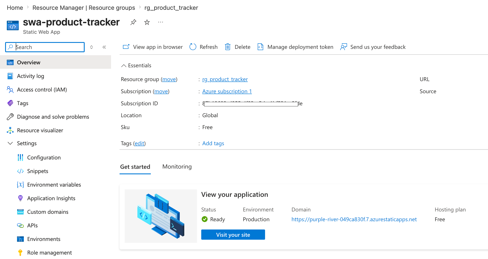
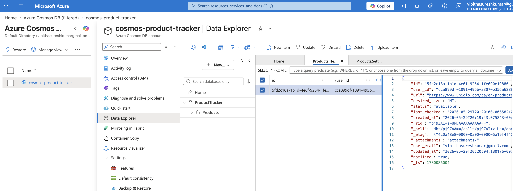
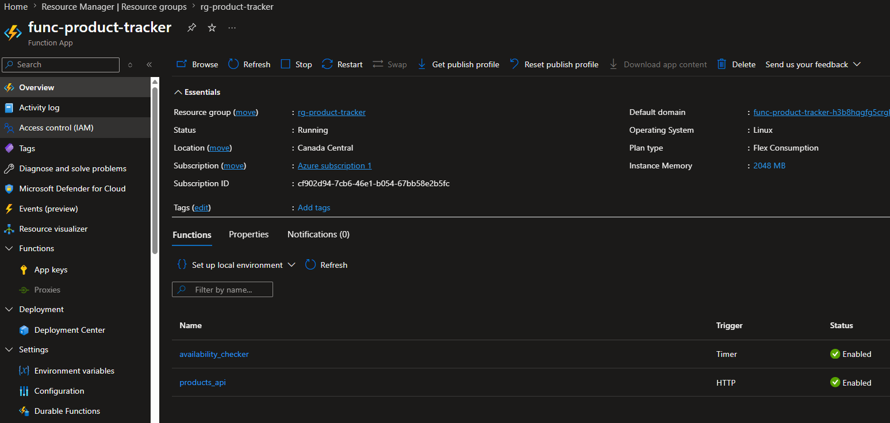
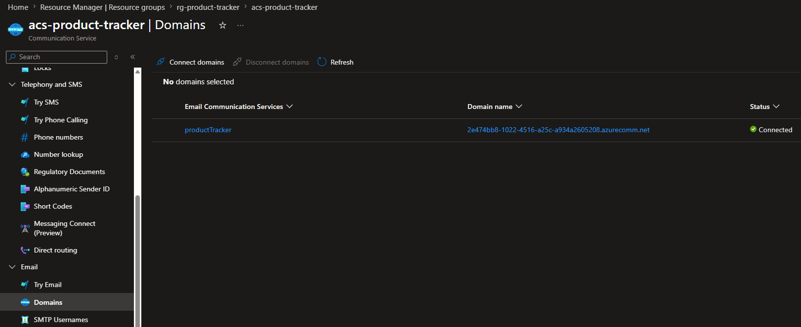
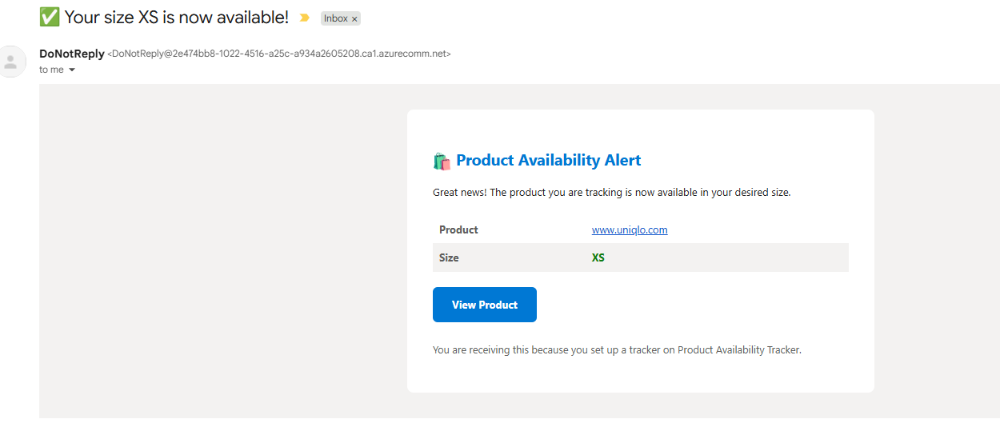
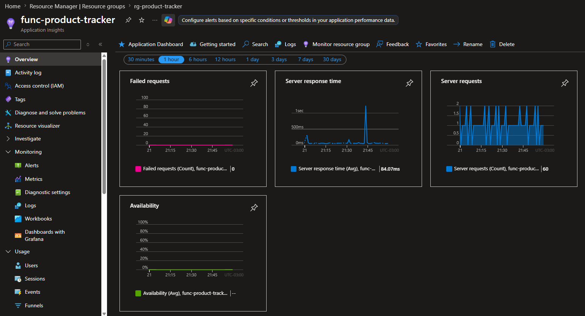

## Product Availability Tracker

A full-stack web application featuring secure authentication that allows users to add public product URLs with desired sizes, and receive email notifications when products become available in their desired size.

## Architecture


- **Frontend**: React (Azure Static Web Apps)
- **Backend**: Python (Azure Functions)
- **Database**: Azure Cosmos DB (NoSQL)
- **Authentication**: Azure Entra ID (MSAL)
- **Email**: Azure Communication Services
- **Scraping**: Azure Functions + BeautifulSoup (Timer Triggered)


## API Reference

The backend exposes a CRUD API for managing tracked products. All endpoints require an Azure Entra ID JWT token in the `Authorization` header (`Bearer <token>`).

### 1. List Products
- **Method**: `GET`
- **Endpoint**: `/api/products`
- **Description**: Returns a list of all products tracked by the authenticated user.
- **Output (200 OK)**:
  ```json
  [
    {
      "id": "5772f0b2-7131-4046-828b-e2bbe98c8605",
      "user_id": "user-guid",
      "url": "https://shop.example.com/item/123",
      "desired_size": "M",
      "status": "pending",
      "last_checked": "2023-10-15T12:00:00Z",
      "user_email": "user@example.com"
    }
  ]
  ```

### 2. Add a Product
- **Method**: `POST`
- **Endpoint**: `/api/products`
- **Description**: Adds a new product URL and desired size to track.
- **Input**:
  ```json
  {
    "url": "https://shop.example.com/item/123",
    "desired_size": "M"
  }
  ```
- **Output (201 Created)**:
  ```json
  {
    "id": "new-uuid",
    "url": "https://shop.example.com/item/123",
    "desired_size": "M",
    "user_id": "user-guid",
    "status": "pending",
    "user_email": "user@example.com"
  }
  ```

### 3. Update a Product
- **Method**: `PATCH`
- **Endpoint**: `/api/products/{id}`
- **Description**: Updates the desired size of an existing product.
- **Input**:
  ```json
  {
    "desired_size": "L"
  }
  ```
- **Output (200 OK)**:
  ```json
  {
    "id": "existing-uuid",
    "url": "https://shop.example.com/item/123",
    "desired_size": "L",
    "user_id": "user-guid",
    "status": "pending",
    "last_checked": "2023-10-15T12:00:00Z",
    "user_email": "user@example.com"
  }
  ```

### 4. Delete a Product
- **Method**: `DELETE`
- **Endpoint**: `/api/products/{id}`
- **Description**: Stops tracking and deletes the product from the database.
- **Output (200 OK)**:
  ```json
  {
    "message": "Deleted"
  }
  ```


**Brief Overview of Deployment Steps**:
1. Provision Azure Cosmos DB for NoSQL and set up the database and container.
2. Set up an Azure Communication Services resource and a managed email domain.
3. Configure Azure Entra ID (App Registration) for authentication.
4. Deploy the backend to an Azure Function App (Python 3.11+, Consumption plan).
5. Deploy the frontend React app to Azure Static Web Apps.

## Application Flow & Screenshots
1. **Frontend Landing Page**: The initial view of the Static Web App before logging in.
   
2. **Authentication Setup**: Configuring the redirect URI in Azure Entra ID to enable MSAL authentication for the frontend.
   
3. **Application Dashboard**: Once authenticated, users can add and view their tracked products on the main dashboard.
   
4. **Static Web App Deployment**: The deployed frontend resource in the Azure portal.
   
5. **Cosmos DB Storage**: Tracked product data stored in the Azure Cosmos DB NoSQL container.
   
6. **Backend Processing**: The Azure Functions handling API requests and timer-based scraping tasks.
   
7. **Email Service Configuration**: Setting up Azure Communication Services to handle automated emails.
   
8. **Notification Received**: The email alert sent to the user when a tracked product's desired size is available.
   
9. **System Monitoring**: Tracking the application's health and performance using Application Insights.
   
